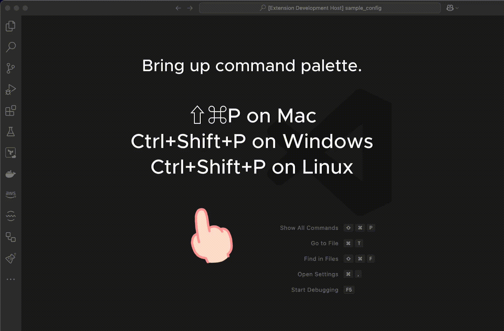

# CHKware extension for Visual Studio Code

Edit and modify [**CHKware** ](https://chkware.com/) (Check-Ware) spec. (`.chk`) files using this _Visual Studio Code_ extension.

## Setup

Follow [extension setup guide](https://chkware.com/docs/setup/setup-ext) to install. New to CHKwere? Read the [_quick start_](https://chkware.com/docs/quick-start).

Here is [setup steps for extension developer](https://chkware.com/docs/setup/setup-ext-dev).

## Usage

Using VS Code [command palette](https://code.visualstudio.com/docs/getstarted/userinterface#_command-palette) you can quickly select a snippet from added samples.

- Use `⇧⌘P` on Mac, `Ctrl+Shift+P` on Windows, and `Ctrl+Shift+P` on Linux to bring up command palette.
- Start writing `CHKware ..`
- Select a sample from dropdown you desire to use.   

## List of sample snippets of document specifications

### [Fetch](https://chkware.com/docs/examples/http-examples)

- http: Minimal request
- http: GET with query string
- http: POST form submit
- http: POST with header and bearer token
- http: POST with JSON body
- http: PUT with file upload

### [Validate](https://chkware.com/docs/examples/validate-examples)

- validate: Minimal validate spec
- validate: Validate spec with setting data
- validate: Validate spec with setting data and variables

### [Workflow](https://chkware.com/docs/examples/workflow-examples)

- workflow: Minimal workflow spec
- workflow: Set data for validate task
- workflow: Set variables and arguments (validate tasks)
- workflow: Set variables (dynamic) and arguments (validate tasks)

## Get help

Have a question? [Ask here](https://github.com/orgs/chkware/discussions/categories/q-a).

---

Licensed under [MIT](/LICENSE) | Get [CHKware updates](https://chkware.com/blog)
